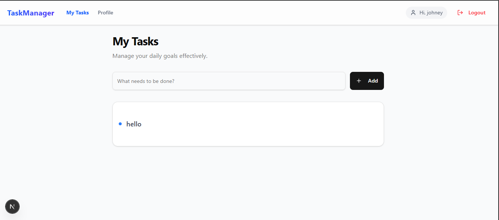

# 📝 Scalable Task Manager App

A modern, scalable web application for managing tasks and user profiles. Built with **Next.js 14**, **Node.js**, **Express**, and **MongoDB**. This project features secure JWT authentication, a responsive dashboard, and a clean split-screen UI design.

## 🚀 Features

### ✅ Frontend (Next.js)
* **Modern UI**: Built with Tailwind CSS and Shadcn UI for a sleek, accessible design.
* **Authentication**: Secure Login and Register pages with client-side validation.
* **Dashboard**: Protected route to view and edit user profile (Name/Email).
* **Task Management**: Create, Read, and Delete tasks directly from the home page.
* **Responsive**: Fully optimized for desktop, tablet, and mobile devices.

### ✅ Backend (Node.js & Express)
* **Secure API**: RESTful endpoints protected by JWT authentication middleware.
* **Database**: MongoDB integration with Mongoose for schemas (Users & Tasks).
* **Security**: Password hashing with `bcrypt` and HTTP-only cookies for token storage.
* **CORS Configured**: Secure communication between frontend (port 3000) and backend (port 5000).

---

## 🛠️ Tech Stack

| Component | Technology |
| :--- | :--- |
| **Frontend** | Next.js 14 (App Router), React, TypeScript, Tailwind CSS, Axios, Lucide React |
| **Backend** | Node.js, Express.js, JSON Web Token (JWT), Bcrypt, Cookie Parser |
| **Database** | MongoDB, Mongoose |

---

## ⚙️ Getting Started

Follow these instructions to set up the project locally.

### Prerequisites
* Node.js (v18 or higher)
* MongoDB (installed locally or a MongoDB Atlas URI)

### 1. Clone the Repository
```bash
git clone [https://github.com/yourusername/taskpt.git](https://github.com/yourusername/taskpt.git)
cd taskpt

```

### 2. Backend Setup

Navigate to the backend folder and install dependencies.

```bash
cd backend
npm install

```

**Configure Environment Variables:**
Create a `.env` file in the `backend/` folder (though for this simple setup, hardcoded values are currently used in `db.js`, it's best practice to switch to `.env`).

**Start the Server:**

```bash
npm run dev
# Server runs on http://localhost:5000

```

### 3. Frontend Setup

Open a new terminal, navigate to the frontend folder, and install dependencies.

```bash
cd frontend
npm install

```

**Start the Application:**

```bash
npm run dev
# App runs on http://localhost:3000

```

---

## 📂 Project Structure

```bash
task-manager/
├── backend/                # Express Server
│   ├── src/
│   │   ├── config/         # DB Connection
│   │   ├── controllers/    # Logic for User & Tasks
│   │   ├── middlewares/    # Auth Middleware
│   │   ├── models/         # Mongoose Schemas
│   │   ├── routes/         # API Routes
│   │   └── server.js       # Entry Point
│   └── package.json
│
└── frontend/               # Next.js Client
    ├── app/                # App Router Pages
    │   ├── login/
    │   ├── register/
    │   ├── dashboard/
    │   └── page.tsx        # Home/Tasks Page
    ├── components/         # Reusable UI Components
    ├── lib/                # API & Utils
    └── package.json

```

---

## 🔌 API Reference

### Auth Routes

| Method | Endpoint | Description |
| --- | --- | --- |
| `POST` | `/api/auth/register` | Register a new user |
| `POST` | `/api/auth/login` | Login and receive HTTP-only cookie |
| `POST` | `/api/auth/logout` | Clear auth cookie |
| `GET` | `/api/auth/me` | Get current user profile (Protected) |
| `PUT` | `/api/auth/me` | Update user profile (Protected) |

### Task Routes

| Method | Endpoint | Description |
| --- | --- | --- |
| `GET` | `/api/tasks` | Get all tasks for logged-in user |
| `POST` | `/api/tasks` | Create a new task |
| `DELETE` | `/api/tasks/:id` | Delete a task |

---

## 📸 Screenshots

### Login Page


### Task Dashboard



---

## 🤝 Contributing

1. Fork the project
2. Create your feature branch (`git checkout -b feature/AmazingFeature`)
3. Commit your changes (`git commit -m 'Add some AmazingFeature'`)
4. Push to the branch (`git push origin feature/AmazingFeature`)
5. Open a Pull Request

---

## 📄 License

Distributed under the MIT License. See `LICENSE` for more information.

```


